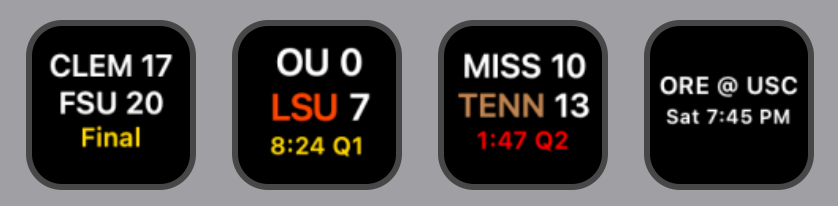

# Live CFB Scores — Stream Deck Plugin

A Stream Deck plugin that shows live college football scores directly on your buttons. Each button tracks one FBS team and updates automatically every 30 seconds.

 

---

## Features

- **Live scores** — shows away score, home score, quarter, and game clock while a game is in progress
- **Possession indicator** — the team with the ball is shown in brown, turning orange if they're in the red zone
- **Two-minute timeout** — the clock turns red during the final 2:00 of the 2nd and 4th quarters
- **Pre-game** — shows the matchup (e.g. `MRSH @ UGA`) and scheduled kickoff day/time
- **Final scores** — shows the final score with a "Final" label, including OT/2OT labeling for overtime games
- **Score-change flash** — when a team scores, the button flashes in that team's primary color
- **End-of-game fireworks** — a short celebratory animation in the winning team's colors plays when the game ends
- **Gamecast shortcut** — press any button to open that game directly in ESPN Gamecast
- **Off-week shortcut** — if your team has no game scheduled, pressing the button opens that team's full schedule on ESPN instead
- **No-flicker updates** — buttons only redraw when the display actually changes
- **Multi-button support** — add as many team buttons as you want, each refreshes independently
- **All 136 FBS teams** across all 11 conferences (SEC, Big Ten, ACC, Big 12, American, Mountain West, Conference USA, MAC, Sun Belt, Pac-12, and Independents)

---

## Recent Updates

**v1.0.3.0**
- Fixed buttons showing "Err" for every team — ESPN started rejecting the plugin's request headers with a 403 page instead of returning score data; requests now use a real browser-style header set (User-Agent, Accept, Accept-Encoding) with matching gzip/brotli response decoding

**v1.0.2.0**
- Replaced the plugin icon with properly sized 256×256 / 512×512 (high-DPI) variants per Elgato's Marketplace icon spec
- Moved the red zone indicator off the clock and onto the possessing team's abbreviation, which now turns orange when they're in the red zone (instead of the clock line changing color)
- Added a two-minute timeout indicator — the clock turns red during the final 2:00 of the 2nd and 4th quarters
- Lightened the possession color from a darker sienna to a more legible tan-brown
- Tuned live/final score line sizing to two fixed sizes (17pt for 2-3 letter abbreviations, 16pt for 4-letter ones) instead of always shrinking dynamically, with an automatic fallback for the handful of especially wide abbreviation/score combinations that would otherwise run too wide for the button
- Fixed a sizing bug where the space between the abbreviation and score was measured as nearly a full letter wide, shrinking the font a point smaller than necessary in most games

**v1.0.1.0**
- Added an off-week shortcut — pressing a button with no game scheduled now opens that team's schedule on ESPN instead of just refreshing
- Rebuilt the settings panel with a search box (type a team or location name for instant results) alongside the existing conference/team browse dropdowns
- Fixed a centering inconsistency in the live score line caused by an inaccurate character-width estimate; text now measures against real Helvetica glyph widths
- Added `flashing` state cleanup on button removal to prevent a rare stuck-flash edge case

**v1.0.0.0**
- Initial release — live scores, possession indicator, red zone highlighting, pre-game/final states, score-change flash, end-of-game fireworks, Gamecast shortcut, and all 136 FBS teams across 11 conferences

---

## Requirements

- [Elgato Stream Deck](https://www.elgato.com/stream-deck) hardware
- [Stream Deck software](https://www.elgato.com/downloads) version 6.9 or later (Mac or Windows)
- No account or API key required — the plugin uses ESPN's free public scoreboard API

---

## Installation

1. Download the latest **`Live CFB Scores.streamDeckPlugin`** from the [Releases](../../releases) page
2. Double-click the file — Stream Deck will install it automatically
3. The plugin will appear in the Stream Deck action picker under **Live CFB Scores**

---

## Setup

1. Drag the **Live CFB Scores** action onto any button
2. In the settings panel on the right, find your team by typing into the search box or by picking a conference and then a team from the dropdowns
3. That's it — the button will load your team's current or upcoming game within a few seconds and refresh every 30 seconds from there

---

## What the Button Shows



**Before the game:**
```
MRSH @ UGA
 Sat 7:30 PM
```

**Live game:**
```
MRSH   7
UGA   45
Q4 2:13
```
The team with the ball is colored brown (orange in the red zone); the clock turns red during the two-minute timeout.

**Final score:**
```
MRSH   7
UGA   45
 Final
```

**Off week:**
```
 UGA
No Game
```
Pressing the button in this state opens that team's schedule on ESPN.

---

## How It Works

The plugin polls [ESPN's public college football scoreboard API](https://site.api.espn.com/apis/site/v2/sports/football/college-football/scoreboard) once every 30 seconds per button. No API key or account is required. The plugin is fully self-contained — it uses only Node.js built-in modules and requires no external dependencies.

Because FBS teams play roughly once per week rather than daily, the plugin queries a rolling 15-day window (one week back, one week ahead) and picks the most relevant game for your team: a game in progress takes priority over an upcoming game, which takes priority over last week's final — so the button holds onto a result until the next game appears on the schedule.

---

## Uninstalling

Open Stream Deck → Preferences → Plugins, select **Live CFB Scores**, and click the **−** button.

---

## Contributing

Bug reports and feature requests are welcome — open an [Issue](../../issues) to get started.

---

## Disclaimer

This plugin is not affiliated with, endorsed by, or sponsored by the NCAA, ESPN, or any conference or institution. All data is sourced from ESPN's public scoreboard API and is subject to ESPN's terms of use. This plugin is intended for individual, personal, non-commercial use only.

---

## Credits

Created by **T.J. Lauerman aka ThatSportsGamer**

Created with Claude Cowork by Anthropic

Data provided by [ESPN](https://www.espn.com/college-football/)
